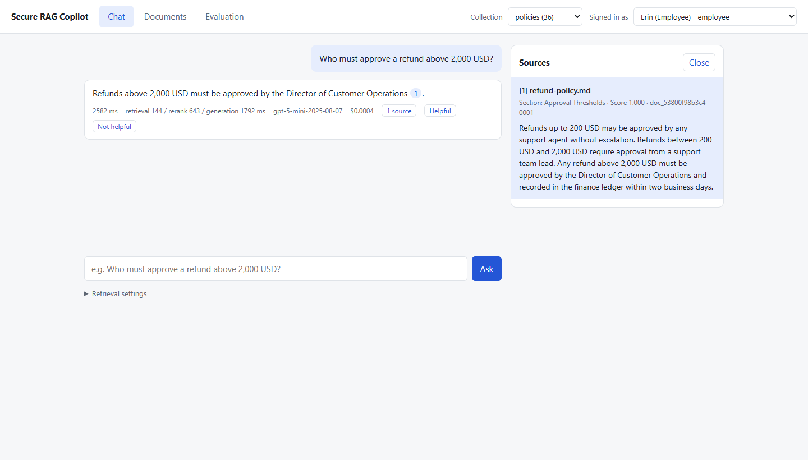

# Secure Enterprise RAG Copilot

Hybrid retrieval (BM25 + dense), cross-encoder reranking, grounded answers with citations,
document-level ACLs and an evaluation suite. Requirements are in `docs/PRD.md`.



The local UI answering a demo-corpus question with the supporting passage open.

## Run locally (no Docker)

    uv sync
    uv run python -m scripts.generate_corpus      # demo corpus + evals/dataset.jsonl
    uv run python -m scripts.ingest_corpus        # 125 documents, ~630 pages
    uv run uvicorn app.main:app                   # UI at http://localhost:8000, API docs at /docs

Local mode uses SQLite and embedded Qdrant (one process at a time: stop the API before
running the ingest or eval scripts). Set `OPENAI_API_KEY` to answer with OpenAI;
without it an offline extractive generator is used.

## Run with Docker

    docker compose up --build
    docker compose exec api python -m scripts.generate_corpus
    docker compose exec api python -m scripts.ingest_corpus

## Tests and evaluation

    uv run pytest
    uv run python -m scripts.run_eval --all                # results in evals/experiments/results/
    uv run python -m scripts.run_eval --all --judge llm    # OpenAI answer-quality judge
    uv run python -m scripts.run_eval --all --no-generate  # retrieval metrics only

Demo users (`POST /auth/token`): `u_employee`, `u_finance`, `u_engineer`, `u_admin`.

## What it does

- **Ingestion**: PDF, DOCX, Markdown, HTML, TXT. Header/footer cleaning, section-aware chunking
  (`CHUNK_SIZE`, `CHUNK_OVERLAP`), idempotent re-ingestion by checksum and version, retryable jobs.
- **Retrieval**: BM25, dense and hybrid (RRF or weighted fusion) plus a cross-encoder reranker.
  `top_k`, fusion weights, reranker candidate count and final context count are configurable
  per request and per experiment.
- **Generation**: answers only from retrieved context, inline `[n]` citations mapped to chunk
  ids, explicit refusal when evidence is missing.
- **Security**: JWT auth for simulated users, role-based document ACLs enforced inside each
  retriever and re-checked before reranking. See `docs/architecture.md`.
- **Evaluation**: 136 labeled cases (98 answerable of which 54 are paraphrased, 12 unanswerable,
  26 ACL), retrieval and answer metrics, latency and cost.
- **UI**: chat, citations drawer, upload, collection selector, evaluation dashboard.

## How it works

### 1. A document is uploaded

1. A signed-in user sends a file to `POST /documents` with a collection name and the roles
   allowed to read it. Users can only restrict a document to roles they hold themselves.
2. The API checks the file type and size, computes a SHA-256 checksum and looks up the document
   by collection and filename. Identical content is skipped; changed content becomes a new version.
3. The file is saved and an ingestion job is queued (a Redis worker in Docker, a background task
   locally). The API returns immediately with status `pending`.

### 2. The document is ingested

1. **Parse**: a parser per format (PDF, DOCX, Markdown, HTML, TXT) produces text blocks, each
   tagged with its page and section heading.
2. **Clean**: running headers, footers and page numbers that repeat across pages are removed.
3. **Chunk**: sentences are packed into chunks of about 220 tokens with 40 tokens of overlap.
   A chunk never crosses a section boundary.
4. **Embed**: each chunk (prefixed with its document title and section) is turned into a
   384-dimension vector.
5. **Store**: chunk text and metadata go to PostgreSQL; vectors go to Qdrant together with the
   collection and the allowed roles. Chunks of the previous version are deleted first.
6. The document becomes `ready`, or `failed` with an error message. Failures other than parse
   errors are retried.

### 3. A question is asked

1. **Authenticate**: `POST /query` carries a JWT. The user's roles are looked up from the user
   directory, never taken from the request body.
2. **Scope**: the system lists the documents in the collection that this user may read.
   Everything after this step is limited to that list.
3. **Retrieve**: two searches run over the authorized chunks only. BM25 finds exact word
   matches; dense search in Qdrant finds passages with similar meaning, filtered by role.
4. **Fuse**: the two ranked lists are merged with reciprocal rank fusion (or a weighted sum).
5. **Re-check**: any candidate whose document is not on the authorized list is dropped. This
   protects against a stale or wrong ACL in the vector index.
6. **Rerank**: a cross-encoder reads the question together with each of the top 20 candidates
   and rescores them. The best 5 become the context.
7. **Generate**: the model receives the 5 passages as numbered sources and must answer only
   from them, marking each claim with `[n]`, or say that the evidence is insufficient.
8. **Cite**: each `[n]` is mapped back to its chunk. Markers pointing at anything outside the
   context are removed. The response contains the answer, the citations with document, page,
   section and passage text, timings, token usage and estimated cost.
9. **Cache and log**: the answer is cached under a key that includes the user's roles and the
   versions of the documents they can see. The log line holds ids and timings, not text.

### 4. Quality is measured

1. Each of the 136 evaluation cases names a question, the user asking it, the expected answer
   and a quote from the source document. Quotes are matched to chunk ids at run time.
2. The runner sends every case through the same query path as the API, for each retrieval
   configuration in `evals/experiments/`.
3. It reports Recall@K, Precision@K, MRR and nDCG@K for answerable questions, answer
   correctness, groundedness and citation correctness for the answers, refusal accuracy for
   questions that must be declined, the number of leaked chunks, latency percentiles and cost.

Diagrams and the security model are in `docs/architecture.md`.

## Measured results

Measured on **2026-10-09**: all six experiments, 136 cases each (816 case runs).
Corpus: 125 synthetic documents, 630 pages, 1,900 chunks (chunk size 220, overlap 40).
K = 10; 98 answerable cases (54 paraphrased), 12 unanswerable and 26 ACL cases.
Embedder `BAAI/bge-small-en-v1.5`, reranker `Xenova/ms-marco-MiniLM-L-6-v2`, retrieval and
reranking on a shared Windows laptop with an Intel Core i7-10750H CPU (6 cores / 12 logical processors).
Both generation and the LLM judge use `gpt-5-mini` with reasoning effort `low`.

With `OPENAI_API_KEY` configured, reproduce in PowerShell after stopping the local API:

```powershell
$env:OPENAI_MODEL = "gpt-5-mini"
$env:JUDGE_MODEL = "gpt-5-mini"
$env:OPENAI_REASONING_EFFORT = "low"
$env:LLM_INPUT_PRICE_PER_MTOK = "0.25"
$env:LLM_OUTPUT_PRICE_PER_MTOK = "2.0"
uv run python -m scripts.run_eval --all --judge llm
```

Retrieval quality (98 answerable cases):

| Experiment | Recall@10 | MRR | nDCG@10 | ACL leaks |
|---|---:|---:|---:|---:|
| BM25 | 0.663 | 0.576 | 0.597 | 0 |
| Dense | 0.949 | 0.889 | 0.904 | 0 |
| Hybrid (RRF) | 0.949 | 0.775 | 0.816 | 0 |
| Hybrid (weighted 0.6/0.4) | 0.959 | 0.860 | 0.884 | 0 |
| Dense + rerank | 0.959 | 0.897 | 0.912 | 0 |
| Hybrid (RRF) + rerank | 0.959 | 0.906 | 0.919 | 0 |

Answer quality (scores from 0 to 1):

| Experiment | Correct | Grounded | Citation | Refusal | False refusal |
|---|---:|---:|---:|---:|---:|
| BM25 | 0.633 | 1.000 | 1.000 | 1.000 | 0.367 |
| Dense | 0.929 | 1.000 | 0.989 | 1.000 | 0.071 |
| Hybrid (RRF) | 0.857 | 1.000 | 0.971 | 1.000 | 0.122 |
| Hybrid (weighted 0.6/0.4) | 0.949 | 0.979 | 1.000 | 1.000 | 0.051 |
| Dense + rerank | 0.918 | 1.000 | 0.989 | 1.000 | 0.082 |
| Hybrid (RRF) + rerank | 0.949 | 1.000 | 0.995 | 1.000 | 0.051 |

End-to-end query latency and estimated generation cost (all 136 cases per experiment):

| Experiment | p50 ms | p95 ms | USD/query |
|---|---:|---:|---:|
| BM25 | 1441.1 | 2582.9 | 0.000401 |
| Dense | 1572.8 | 2816.3 | 0.000494 |
| Hybrid (RRF) | 1577.8 | 2719.9 | 0.000483 |
| Hybrid (weighted 0.6/0.4) | 1681.8 | 2706.1 | 0.000479 |
| Dense + rerank | 2266.2 | 4220.0 | 0.000503 |
| Hybrid (RRF) + rerank | 1987.3 | 2976.3 | 0.000479 |

How to read this:

- Correctness is LLM-judged over all 98 answerable cases; a refusal scores zero. Groundedness
  is LLM-judged only on answers that were not refused. False refusal is the fraction of
  answerable cases incorrectly refused (lower is better). Citation correctness is the fraction
  of cited chunks matching the labeled evidence, averaged over those same answers.
- Refusal accuracy covers the 38 unanswerable/ACL cases. ACL leaks count unauthorized chunks
  returned across all 136 cases; zero observed leaks is a result for this test set.
- Latency includes retrieval, reranking and OpenAI generation with answer caching disabled.
  Query embeddings can be reused between experiments by the default embedding cache.
  Judge calls run afterward and are excluded from query latency. The 2.5 s p95 target is not
  met in this run; see the stage breakdown in [architecture.md](docs/architecture.md#latency-and-cost).
- Cost uses recorded generation token usage at the configured rates of $0.25 per million
  input tokens and $2.00 per million output tokens. It excludes judge calls and infrastructure;
  it is an estimate, not the total evaluation bill.
- The corpus is small and synthetic, with templated filler documents. This is one sequential
  run, not a concurrency/load test or a confidence interval. The generator and judge use the
  same model, so the quality scores are not an independent human assessment.

Full per-case output and the comparison at stored precision are in
[evals/experiments/results/](evals/experiments/results/).

## Configuration

All settings are environment variables (see `app/config.py`). The ones you are most likely to change:

| Variable | Default | Meaning |
|---|---|---|
| `OPENAI_API_KEY` | unset | Enables OpenAI for generation and the LLM judge |
| `OPENAI_MODEL` | `gpt-5-mini` | Generation model |
| `OPENAI_REASONING_EFFORT` | unset (model default) | Set to `low` to reproduce the measured run; also used by the judge |
| `JUDGE_MODEL` | `OPENAI_MODEL` | Model used with `--judge llm` |
| `LLM_INPUT_PRICE_PER_MTOK`, `LLM_OUTPUT_PRICE_PER_MTOK` | `0.25`, `2.0` | Prices used for the cost estimate; set to your model's current list price |
| `RETRIEVAL_MODE` | `hybrid` | `bm25`, `dense` or `hybrid` |
| `RERANK` | `true` | Cross-encoder reranking |
| `MIN_RELEVANCE_SCORE` | `0` | Refuse without calling the LLM when the best reranked chunk scores below this |
| `INGEST_BACKEND` | `background` | `arq` (Redis worker), `background` or `inline` |
| `API_PORT` | `8000` | Host port for the API in Docker Compose |
| `JWT_SECRET` | dev value | Must be set when `ENV=prod` |

## Layout

    app/api          HTTP routes          app/retrieval    BM25, Qdrant, fusion, pipeline
    app/auth         users, JWT, ACL      app/reranking    cross-encoder
    app/ingestion    parse, chunk, embed  app/generation   prompts, LLM, citations
    app/evaluation   dataset, metrics     app/web          static UI
    scripts/         corpus, ingest, eval evals/           dataset.jsonl, experiments/
    docs/            architecture.md, deployment-aws.md

## Not done

Query rewriting, parent-child and multi-query retrieval, semantic caching, OpenTelemetry and the
Bedrock comparison (PRD stretch goals). There are no database migrations.
