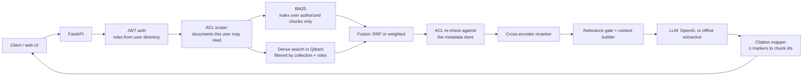
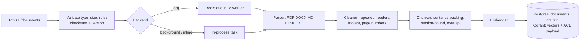

# Architecture

## Query path

Code: `app/generation/service.py` (orchestration), `app/retrieval/pipeline.py` (retrieval),
`app/reranking/reranker.py`, `app/generation/llm.py`, `app/generation/citations.py`.

## Ingestion path

Code: `app/ingestion/pipeline.py`, `parsers.py`, `cleaner.py`, `chunker.py`, `embeddings.py`, `worker.py`.

## Components

| Concern | Choice | Notes |
|---|---|---|
| API | FastAPI, sync handlers | OpenAPI at `/docs` |
| Metadata store | PostgreSQL (SQLite locally and in tests) | `documents`, `chunks`, `eval_cases`, `eval_runs`, `feedback`. Tables are created at start-up; there are no migrations yet |
| Vector store | Qdrant (embedded mode locally) | One collection per embedding model |
| Lexical | `rank_bm25`, in-process | Rebuilt from the chunks table and cached per set of authorized documents |
| Embeddings | `BAAI/bge-small-en-v1.5` via FastEmbed (ONNX, CPU) | 384 dimensions |
| Reranker | `Xenova/ms-marco-MiniLM-L-6-v2` cross-encoder via FastEmbed | Scores squashed to 0..1 |
| Generation | OpenAI Chat Completions (`OPENAI_MODEL`, default `gpt-5-mini`) with a strict JSON-schema response | Falls back to an extractive generator when no API key is configured |
| Cache | Redis, or in-process without `REDIS_URL` | Query embeddings and full answers |
| Background jobs | Arq (Redis) in Docker; FastAPI background tasks locally | Retries with backoff; parse errors are not retried |

## Security model

1. **Identity** comes only from the signed JWT. A `user_id` in the request body must match the
   token or the request is rejected. Roles are looked up in the user directory on every request,
   so a token cannot carry roles the user no longer has.
2. **Scope first.** Every query starts by computing the set of ready documents the user may read
   (`authorized_documents`). `admin` reads everything; anyone else needs a role in the document's
   `allowed_roles`.
3. **Filter inside each retriever.** The BM25 index is built only from authorized chunks, so
   restricted text cannot influence scores. The Qdrant query carries a `collection_id` and
   `allowed_roles` filter.
4. **Re-check before the reranker.** Candidates whose document is not in the authorized set are
   dropped and logged. This is what protects against a stale or corrupted vector payload
   (`test_post_filter_blocks_chunks_when_the_vector_index_acl_is_stale`).
5. **Citations can only point into the context.** A marker that does not refer to a chunk the
   model was shown is removed.
6. **Caches are keyed by roles and by the versions of the documents the user can see**, so an
   answer is never served across an ACL boundary or after re-ingestion.
7. **Read endpoints return 404, not 403**, for documents and chunks the user may not read, so
   restricted documents are not discoverable by id. Uploading over an existing restricted
   document is refused.
8. **Logs** contain ids, sizes and timings. Query and document text are not logged unless
   `LOG_DOCUMENT_TEXT=true`.

What this does not cover: real SSO, per-user (rather than per-role) grants, encryption of stored
uploads, rate limiting, and prompt-injection defences beyond instructing the model to treat
sources as data.

## Evaluation

`evals/dataset.jsonl` labels each case with evidence quotes rather than chunk ids; quotes are
resolved to chunk ids against the current index (`app/evaluation/dataset.py`), so labels survive
a change of chunk size. Three kinds of case:

- `answerable`: the asking user may read the evidence. Scored for Recall@K, Precision@K, MRR,
  nDCG@K, answer correctness, groundedness and citation correctness. 54 of the 98 are
  paraphrased so that they share little vocabulary with the source.
- `unanswerable`: nothing in the corpus answers it. The correct behaviour is a refusal.
- `acl`: the evidence exists but the asking user is not authorized. The correct behaviour is a
  refusal, and any retrieved chunk the user may not read counts as a leak.

The default answer metrics are lexical heuristics (token recall against the expected answer,
token support in the cited passages). `--judge llm` replaces them with an OpenAI judge.

## Latency target

Target: p95 under 2.5 s end to end with reranking on CPU and the OpenAI model generating. Retrieval and
reranking are measured by `scripts/run_eval.py` (see the README for current numbers); generation
latency with the OpenAI model has not been measured yet.
