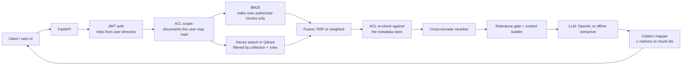
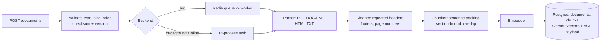

# Architecture

## Query path

Code: `app/generation/service.py` (orchestration), `app/retrieval/pipeline.py` (retrieval),
`app/reranking/reranker.py`, `app/generation/llm.py`, `app/generation/citations.py`.

## Ingestion path

Code: `app/ingestion/pipeline.py`, `parsers.py`, `cleaner.py`, `chunker.py`, `embeddings.py`, `worker.py`.

## Components

| Concern | Choice | Notes |
|---|---|---|
| API | FastAPI, sync handlers | OpenAPI at `/docs` |
| Metadata store | PostgreSQL (SQLite locally and in tests) | `documents`, `chunks`, `eval_cases`, `eval_runs`, `feedback`. Tables are created at start-up; there are no migrations yet |
| Vector store | Qdrant (embedded mode locally) | One collection per embedding model |
| Lexical | `rank_bm25`, in-process | Rebuilt from the chunks table and cached per set of authorized documents |
| Embeddings | `BAAI/bge-small-en-v1.5` via FastEmbed (ONNX, CPU) | 384 dimensions |
| Reranker | `Xenova/ms-marco-MiniLM-L-6-v2` cross-encoder via FastEmbed | Scores squashed to 0..1 |
| Generation | OpenAI Chat Completions (`OPENAI_MODEL`, default `gpt-5-mini`) with a strict JSON-schema response | Falls back to an extractive generator when no API key is configured |
| Cache | Redis, or in-process without `REDIS_URL` | Query embeddings and full answers |
| Background jobs | Arq (Redis) in Docker; FastAPI background tasks locally | Retries with backoff; parse errors are not retried |

## Security model

1. **Identity** comes only from the signed JWT. A `user_id` in the request body must match the
   token or the request is rejected. Roles are looked up in the user directory on every request,
   so a token cannot carry roles the user no longer has.
2. **Scope first.** Every query starts by computing the set of ready documents the user may read
   (`authorized_documents`). `admin` reads everything; anyone else needs a role in the document's
   `allowed_roles`.
3. **Filter inside each retriever.** The BM25 index is built only from authorized chunks, so
   restricted text cannot influence scores. The Qdrant query carries a `collection_id` and
   `allowed_roles` filter.
4. **Re-check before the reranker.** Candidates whose document is not in the authorized set are
   dropped and logged. This is what protects against a stale or corrupted vector payload
   (`test_post_filter_blocks_chunks_when_the_vector_index_acl_is_stale`).
5. **Citations can only point into the context.** A marker that does not refer to a chunk the
   model was shown is removed.
6. **Caches are keyed by roles and by the versions of the documents the user can see**, so an
   answer is never served across an ACL boundary or after re-ingestion.
7. **Read endpoints return 404, not 403**, for documents and chunks the user may not read, so
   restricted documents are not discoverable by id. Uploading over an existing restricted
   document is refused.
8. **Logs** contain ids, sizes and timings. Query and document text are not logged unless
   `LOG_DOCUMENT_TEXT=true`.

What this does not cover: real SSO, per-user (rather than per-role) grants, encryption of stored
uploads, rate limiting, and prompt-injection defences beyond instructing the model to treat
sources as data.

## Evaluation

`evals/dataset.jsonl` labels each case with evidence quotes rather than chunk ids; quotes are
resolved to chunk ids against the current index (`app/evaluation/dataset.py`), so labels survive
a change of chunk size. Three kinds of case:

- `answerable`: the asking user may read the evidence. Scored for Recall@K, Precision@K, MRR,
  nDCG@K, answer correctness, groundedness and citation correctness. 54 of the 98 are
  paraphrased so that they share little vocabulary with the source.
- `unanswerable`: nothing in the corpus answers it. The correct behaviour is a refusal.
- `acl`: the evidence exists but the asking user is not authorized. The correct behaviour is a
  refusal, and any retrieved chunk the user may not read counts as a leak.

The default answer metrics are lexical heuristics (token recall against the expected answer,
token support in the cited passages). `--judge llm` replaces them with an OpenAI judge; the
published results use it.

## Measured answer quality

The 2026-10-09 run evaluated all six configurations on the full 136-case dataset using
`gpt-5-mini` for both generation and judging, with `OPENAI_REASONING_EFFORT=low`.
The corpus contained 125 documents, 630 pages and 1,900 chunks. Retrieval and reranking ran
on an Intel Core i7-10750H CPU (Windows, 6 cores / 12 logical processors); answer caching
was disabled. There were no unresolved evidence labels.

| Experiment | Correct | Grounded | Citation | Refusal | False refusal |
|---|---:|---:|---:|---:|---:|
| BM25 | 0.633 | 1.000 | 1.000 | 1.000 | 0.367 |
| Dense | 0.929 | 1.000 | 0.989 | 1.000 | 0.071 |
| Hybrid (RRF) | 0.857 | 1.000 | 0.971 | 1.000 | 0.122 |
| Hybrid (weighted 0.6/0.4) | 0.949 | 0.979 | 1.000 | 1.000 | 0.051 |
| Dense + rerank | 0.918 | 1.000 | 0.989 | 1.000 | 0.082 |
| Hybrid (RRF) + rerank | 0.949 | 1.000 | 0.995 | 1.000 | 0.051 |

Correctness uses all 98 answerable cases, including false refusals as zero. Groundedness
uses only non-refused answers. False refusal is the fraction of the 98 answerable cases
incorrectly refused (lower is better). Citation correctness is computed from the labeled evidence
chunk IDs, not by the LLM judge, and also excludes refused answers. Refusal accuracy covers
12 unanswerable and 26 ACL cases. All six configurations returned zero unauthorized chunks
across their 136 cases. These are synthetic-corpus results from one run; using the same model
for generation and judging is not an independent quality assessment.

## Latency and cost

Target: p95 under 2.5 s end to end with reranking on CPU and the OpenAI model generating.
The measured run **does not meet this target**. Hybrid (RRF) + rerank measured
1987.3 ms p50 and 2976.3 ms p95.

| Experiment | Retrieval p95 ms | Rerank p95 ms | Generation p95 ms | End-to-end p95 ms |
|---|---:|---:|---:|---:|
| BM25 | 14.8 | 0.0 | 2579.2 | 2582.9 |
| Dense | 65.5 | 0.0 | 2768.4 | 2816.3 |
| Hybrid (RRF) | 71.3 | 0.0 | 2672.3 | 2719.9 |
| Hybrid (weighted 0.6/0.4) | 1058.5 | 0.0 | 2434.7 | 2706.1 |
| Dense + rerank | 86.9 | 1017.2 | 2818.2 | 4220.0 |
| Hybrid (RRF) + rerank | 63.4 | 704.7 | 2329.9 | 2976.3 |

Each percentile is calculated independently over all 136 cases, including refusals;
stage p95 values should not be added together. End-to-end timing covers the query service
(retrieval, reranking, generation and citation mapping), not HTTP/browser overhead or the
subsequent judge calls. The default embedding cache can reuse query vectors between
experiments, so these are not isolated cold-start measurements. This was a sequential
local run on a shared laptop, not a concurrent load test.

| Experiment | Mean input tokens | Mean output tokens | USD/query |
|---|---:|---:|---:|
| BM25 | 593.3 | 126.5 | 0.000401 |
| Dense | 862.8 | 138.9 | 0.000494 |
| Hybrid (RRF) | 816.9 | 139.2 | 0.000483 |
| Hybrid (weighted 0.6/0.4) | 815.6 | 137.6 | 0.000479 |
| Dense + rerank | 886.4 | 140.9 | 0.000503 |
| Hybrid (RRF) + rerank | 831.1 | 135.5 | 0.000479 |

Token counts and costs cover the answer generator only, averaged across all cases.
The estimate uses the run's configured rates of $0.25 per million input tokens and $2.00 per
million output tokens. The runner does not record the judge's token usage or cost, so these
figures cannot be used as the full evaluation bill. Infrastructure costs are also excluded.

The [README](../README.md#measured-results) contains the retrieval comparison and reproduction
command; [raw results](../evals/experiments/results/) include all six configurations,
run IDs, summaries and per-case retrieval/answer scores.
